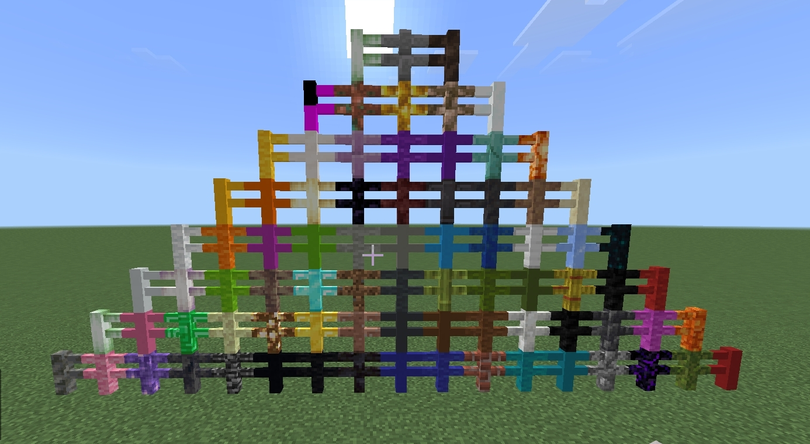

# MoreFences



MoreFences is a plugin for Allay-based servers that provides additional fence block types. The current release defines 79 custom fences.

## Features
- 79 custom fence blocks
- Connection logic via north/south/east/west block-state values
- 24/16 collision height (fence standard)
- Registered under Creative Construction `itemGroup.name.fence`
- EN and TR localization keys
- Embedded resource pack content

## Requirements
- Allay server

## Installation
1) Build:
```
./gradlew build
```
2) Copy the generated jar into your server's plugins directory.
3) If your server is not configured to distribute the embedded resource pack,
   register the pack manually from `src/main/resources/assets/resource_pack`.

## Layout
```
src/main/java/MoreFences/ClexaGod/morefences
src/main/resources/assets/resource_pack
```

## License
This project is licensed under the terms in `LICENSE`.
